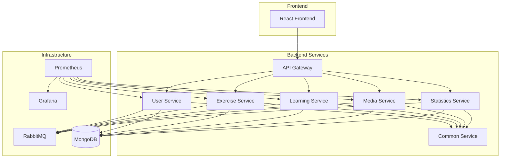

# VNOI Microservice

A modern, distributed online judge system designed to support programming education and competitive programming in Vietnam. Built with a microservices architecture for scalability, maintainability, and reliability.

## 📖 Documentation

For detailed documentation, please visit our [Gitbook](https://vnoi-doc.dorara.id.vn/)
Additional project details can be found in [docs/overview.md](docs/overview.md).

## 🏗️ Architecture Overview



## 🚀 Features

### Frontend

- Modern React-based UI with Material-UI components
- Advanced code editor with syntax highlighting
- Real-time collaboration tools
- Video content streaming
- Interactive learning features
- Comprehensive testing suite (Cypress)
- Performance monitoring and optimization

### Backend Services

#### User Service

- Authentication and authorization
- User profile management
- Role-based access control
- Session management

#### Exercise Service

- Programming problem management
- Solution submission handling
- Automated testing
- Plagiarism detection

#### Learning Service

- Course management
- Content organization
- Progress tracking
- Achievement system

#### Media Service

- File upload and management
- Video streaming
- Content delivery
- Storage optimization

#### Statistics Service

- Performance analytics
- Usage statistics
- Progress tracking
- Reporting tools

#### Common Service

- Shared utilities
- Business logic
- Common interfaces
- Reusable components

## 🛠️ Technical Stack

### Frontend

- React 18
- Vite
- Material UI
- CodeMirror
- React Router
- Axios
- React Query
- Testing:
  - Vitest
  - Cypress
  - K6 for load testing

### Backend

- Node.js
- Express.js
- gRPC
- MongoDB
- RabbitMQ
- Testing:
  - Jest
  - Supertest

### Infrastructure

- Docker
- Docker Compose
- Prometheus
- Grafana
- Firebase

## 🔧 Development Setup

### Prerequisites

- Node.js (Latest LTS)
- pnpm
- Docker and Docker Compose
- MongoDB
- RabbitMQ

### Installation

1. Clone the repository

```bash
git clone https://github.com/holedev/vnoi-microservice.git
cd vnoi-microservice
```

2. Install dependencies

```bash
# Root dependencies
pnpm install

# Client dependencies
cd client
pnpm install

# Server dependencies
cd ../server
pnpm install
```

3. Configure environment variables

```bash
# Client
cp client/.env.example client/.env

# Server services
cp server/user/.env.example server/user/.env
cp server/exercise/.env.example server/exercise/.env
cp server/learning/.env.example server/learning/.env
cp server/media/.env.example server/media/.env
cp server/statistics/.env.example server/statistics/.env
```

4. Start development servers

```bash
# Start all services with Docker
docker-compose -f server/docker-compose.dev.yml up

# Start frontend
cd client
pnpm dev
```

## 📝 Development Guidelines

### Code Style

- ESLint for linting
- Prettier for formatting
- Conventional commits
- Comprehensive documentation

### Git Workflow

1. Branch naming:

   - feature/\* - New features
   - fix/\* - Bug fixes
   - docs/\* - Documentation
   - refactor/\* - Code refactoring

2. Commit messages:
   - feat: Add new feature
   - fix: Bug fix
   - docs: Documentation changes
   - refactor: Code refactoring
   - test: Adding tests
   - chore: Maintenance tasks

### Testing Requirements

- Unit tests for all business logic
- Integration tests for APIs
- E2E tests for critical paths
- Performance tests for optimization

## 🚀 Deployment

### Development

```bash
# Start development environment
docker-compose -f server/docker-compose.dev.yml up
```

### Production

```bash
# Build and start production environment
docker-compose -f server/docker-compose.prod.yml up
```

### Monitoring

- Prometheus metrics
- Grafana dashboards
- Custom logging solution
- Performance tracking

## 📊 Monitoring & Metrics

### Key Metrics

- API response times
- Error rates
- Resource usage
- User engagement

### Dashboards

- System overview
- Service health
- User activity
- Performance metrics

## 🔒 Security

### Authentication

- JWT-based authentication
- Role-based access control
- Service-to-service auth
- Secure session management

### Data Protection

- Encryption at rest
- Secure communication
- Input validation
- XSS protection

## 📚 Documentation

### API Documentation

- REST API endpoints
- gRPC service definitions
- Data models
- Authentication flows

### Architecture Documentation

- Service interactions
- Data flow diagrams
- Deployment architecture
- Security measures

## 🤝 Contributing

1. Fork the repository
2. Create your feature branch
3. Commit your changes
4. Push to the branch
5. Create a pull request
